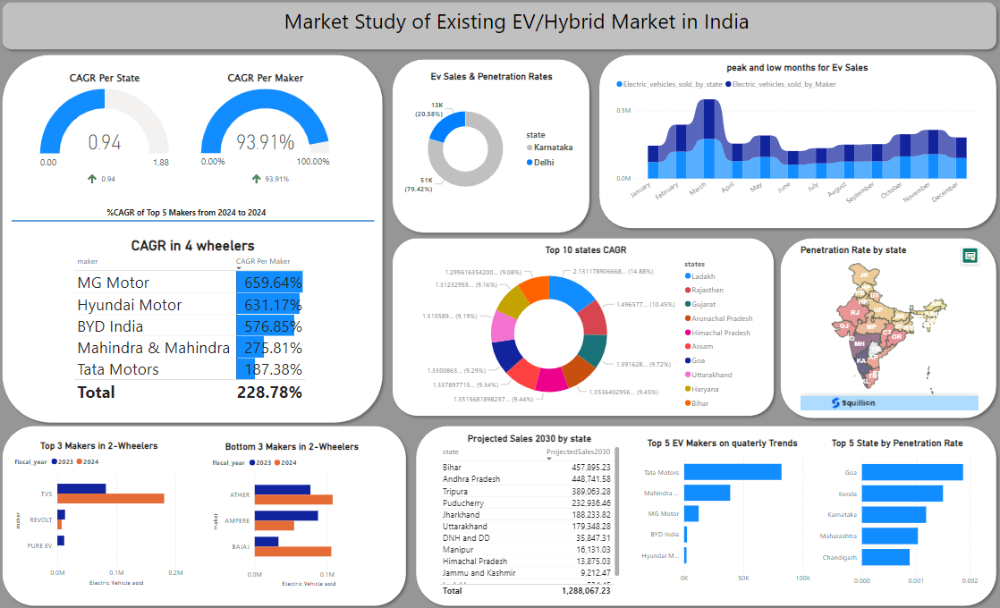

# 🚗 AtliQ Motors - EV Market Expansion in India 📊

## 📋 Project Overview
AtliQ Motors, a leading name in the North American EV market, is planning to expand into India, where their market share is currently under 2%. This project explores the potential for growth, uncovers key market trends, and provides data-driven insights to guide their entry strategy.

## 🚀 Problem Statement
With fierce competition and diverse regional challenges, AtliQ Motors needs a comprehensive understanding of the Indian EV market to successfully penetrate and grow in this emerging sector.

## 🛠️ Tools and Approaches
- **Data Analysis:** Python, SQL
- **Visualization:** Power BI, Tableau
- **Presentation:** PowerPoint, Video Editing Software
- **Research:** Industry Reports, Government Policies

## 🔍 Key Findings
- **Top Growth States:** Maharashtra, Karnataka, and Tamil Nadu show the highest EV adoption rates.
- **Sales Trends:** 2-wheelers dominate the market, with 4-wheelers exhibiting a faster growth rate.
- **Seasonal Patterns:** Festive periods drive peak sales, while the monsoon season shows a dip.

## 💡 Proposed Solution
By leveraging strategic partnerships, localized marketing, and tailored incentive programs, AtliQ Motors can significantly increase its market share in India. The approach is phased, focusing on high-growth states and segments, ensuring a sustainable and scalable entry.

